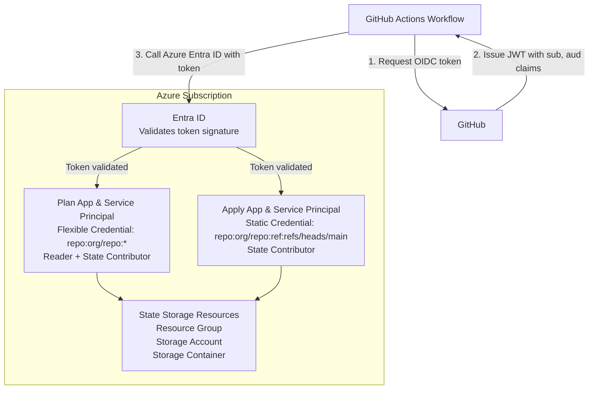

# Azure GitHub Pipelines Bootstrap Stack

## Overview

This Terragrunt stack bootstraps Azure infrastructure for GitHub Actions with OIDC authentication. It creates all necessary Azure resources to enable secure, keyless authentication from GitHub Actions workflows to your Azure subscription for [Gruntwork Pipelines](https://www.gruntwork.io/platform/pipelines).

## What This Stack Creates

### State Storage Resources

- Azure Resource Group for state management
- Azure Storage Account for OpenTofu state
- Storage Container for state files

### OIDC Resources for Plan Operations

- Entra ID Application for plan operations
- Service Principal for the application
- Flexible Federated Identity Credential (allows any branch on a given repository to assume the role)
- Custom role definition with read-only permissions for Azure resources
- Custom role assignment at subscription level
- Contributor role assignment to state storage account

### OIDC Resources for Apply Operations

- Entra ID Application for apply operations
- Service Principal for the application
- Static Federated Identity Credential (main branch only)
- Custom role definition with full management permissions for bootstrap resources
- Custom role assignment at subscription level

## Usage

Read the [official Gruntwork Pipelines installation guide](https://docs.gruntwork.io/2.0/docs/pipelines/installation/addingnewrepo) for usage instructions.

## Values

### Required

| Name | Description | Example |
|------|-------------|---------|
| `location` | Azure region for resources | `East US` |
| `state_resource_group_name` | Resource group for state storage | `tofu-state-rg` |
| `state_storage_account_name` | Storage account name (globally unique) | `tfstate12345678` |
| `github_org_name` | GitHub organization or username | `my-org` |
| `github_repo_name` | GitHub repository name | `infrastructure` |

### Optional

| Name | Description | Default |
|------|-------------|---------|
| `terragrunt_scale_catalog_url` | URL of this catalog | `github.com/gruntwork-io/terragrunt-scale-catalog` |
| `terragrunt_scale_catalog_ref` | Git ref to use | `main` |
| `state_storage_container_name` | Container name for state files | `tfstate` |
| `oidc_resource_prefix` | Prefix for Entra ID resources | `pipelines` |
| `github_token_actions_domain` | GitHub Actions token domain | `token.actions.githubusercontent.com` |
| `github_org_id` | Numeric GitHub organization/user ID. Required for all repos created on or after 2026-07-15 (see [Immutable Subject Claims](#immutable-subject-claims) below); leave blank for existing repos that haven't opted in. Must be set together with `github_repo_id`. | `1234567` |
| `github_repo_id` | Numeric GitHub repository ID. Must be set together with `github_org_id`. | `987654321` |
| `audiences` | OIDC audiences | `["api://AzureADTokenExchange"]` |
| `issuer` | OIDC issuer URL | `https://token.actions.githubusercontent.com` |
| `deploy_branch` | Branch allowed for applies | `main` |
| `plan_service_principal_to_sub_role_definition_assignment` | Role for plan SP at subscription level | `Reader` |
| `plan_service_principal_to_state_role_definition_assignment` | Role for plan SP on state storage | `Contributor` |
| `apply_service_principal_to_state_role_definition_assignment` | Role for apply SP on state storage | `Contributor` |

## Stack Architecture



## Federated Credentials

### Plan (Flexible - Any Branch)

Uses a **flexible federated identity credential** with claim matching:

```text
claims['sub'] matches 'repo:my-org/my-repo:*'
```

This allows plans from:

- Any branch
- Pull requests

**Note**: Requires Azure CLI (`az rest` command) due to Beta API usage.

### Apply (Static - Main Branch Only)

Uses a **static federated identity credential** with exact subject:

```text
subject: repo:my-org/my-repo:ref:refs/heads/main
```

This only allows applies from the `main` branch.

## Immutable Subject Claims

GitHub is rolling out an [immutable subject-claim format](https://github.blog/changelog/2026-04-23-immutable-subject-claims-for-github-actions-oidc-tokens/) for Actions OIDC tokens, which embeds numeric, immutable org/repo IDs in the `sub` claim (`repo:org@org_id/repo@repo_id:...`) instead of names alone. **Starting 2026-07-15, this format is required for all newly created GitHub repositories.**

Both the flexible (plan) and static (apply) federated identity credentials above are keyed off the `sub` claim, so both switch to the immutable format together.

To opt in (or if your repo is subject to the new requirement), set both `github_org_id` and `github_repo_id`:

```hcl
values = {
  github_org_name  = "my-org"
  github_repo_name = "infrastructure"
  github_org_id    = "1234567"
  github_repo_id   = "987654321"
}
```

You can look up the numeric IDs with:

```bash
gh api repos/{owner}/{repo} --jq '{owner_id: .owner.id, repo_id: .id}'
```

Leave both values unset to keep the legacy `repo:org/repo:...` format. Both must be set together — setting only one falls back to the legacy format.

## Custom Role Permissions

This stack creates custom Azure RBAC roles that provide least-privilege access for ongoing maintenance of bootstrap resources.

### Plan Custom Role (Read-Only)

Permissions granted:

- `*/read` - Read all Azure resources
- `Microsoft.Resources/subscriptions/resourceGroups/read`
- `Microsoft.Resources/deployments/read`
- `Microsoft.Resources/deployments/operations/read`
- `Microsoft.Storage/storageAccounts/listKeys/action` - Access state storage keys
- `Microsoft.Storage/storageAccounts/blobServices/containers/read`

**Purpose**: Generate Terraform plans without making any changes.

### Apply Custom Role (Full Management)

Permissions granted:

- `*/read` - Read all Azure resources
- `Microsoft.Resources/subscriptions/resourceGroups/*` - Manage resource groups
- `Microsoft.Resources/deployments/*` - Manage deployments
- `Microsoft.Storage/storageAccounts/*` - Manage storage accounts and all services
- `Microsoft.Authorization/roleAssignments/*` - Manage role assignments
- `Microsoft.Authorization/roleDefinitions/*` - Manage custom role definitions

**Purpose**: Create, update, and destroy all bootstrap stack resources.

### Customizing Permissions

You can override the default permissions by providing custom actions:

```hcl
values = {
  plan_custom_role_actions = [
    "*/read",
    "Microsoft.Compute/virtualMachines/read",
    # Add additional read permissions as needed
  ]

  apply_custom_role_actions = [
    "*/read",
    "Microsoft.Resources/subscriptions/resourceGroups/*",
    "Microsoft.Compute/virtualMachines/*",
    # Add additional permissions as needed
  ]
}
```

### Entra ID Permissions

**Important**: Azure RBAC custom roles only grant permissions for Azure Resource Manager operations. To manage Entra ID resources (applications, service principals, federated credentials), the user or system performing the bootstrap must have appropriate **Azure AD directory roles** assigned:

- **Application Administrator** - Minimum required role
- **Cloud Application Administrator** - Alternative role
- **Global Administrator** - Full access (use sparingly)

These directory roles must be assigned manually by a Global Administrator and are **separate from Azure RBAC roles**.

**During Initial Bootstrap**: The user running the stack needs Owner (Azure RBAC) + Application Administrator (Directory Role).

**For Ongoing Maintenance**: The service principals will have:

- Azure resources: Managed via custom RBAC roles (sufficient for all Azure RM resources)
- Entra ID resources: Require directory role assignment (must be granted separately)

## Security Considerations

### Branch Protection

The apply role is restricted to the `deploy_branch` (default: `main`). Ensure you have branch protection rules:

- Require pull request reviews
- Require status checks to pass
- Restrict who can push

### Least Privilege

This stack implements least-privilege access through custom roles:

- **Plan role**: Read-only access at subscription level plus scoped Contributor access to state storage only
- **Apply role**: Full management of bootstrap resources at subscription level, scoped to necessary operations
- **No redundant roles**: Built-in Reader and Contributor roles at subscription level have been removed to avoid permission overlap

## Outputs

| Name | Description |
|------|-------------|
| plan_app.client_id | Client ID of the plan application |
| plan_app.id | Object ID of the plan application |
| plan_service_principal.object_id | Object ID of the plan service principal |
| apply_app.client_id | Client ID of the apply application |
| apply_app.id | Object ID of the apply application |
| apply_service_principal.object_id | Object ID of the apply service principal |
| resource_group.name | Name of the state storage resource group |
| storage_account.id | ID of the state storage account |

## Related Documentation

- [GitHub Actions with Azure](https://learn.microsoft.com/en-us/azure/developer/github/connect-from-azure)
