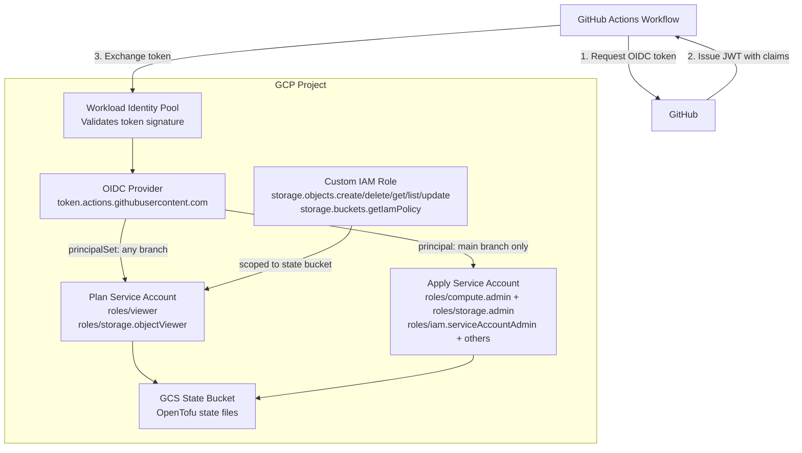

# GCP GitHub Pipelines Bootstrap Stack

## Overview

This Terragrunt stack bootstraps GCP infrastructure for GitHub Actions with OIDC authentication using Workload Identity Federation. It creates all necessary GCP resources to enable secure, keyless authentication from GitHub Actions workflows to your GCP project for [Gruntwork Pipelines](https://www.gruntwork.io/platform/pipelines).

## What This Stack Creates

### Workload Identity Pool & Provider

- Workload Identity Pool for GitHub Actions
- OIDC provider configured for GitHub's token issuer
- Attribute mapping for GitHub token claims

### Plan Service Account (Read-Only Operations)

- Service account for running Terragrunt plans
- Workload Identity binding using `principalSet` (allows any branch/PR from the repository)
- Default project-level IAM roles: `roles/viewer`, `roles/storage.objectViewer`
- A project-level custom IAM role is created (ID: `<oidc_resource_prefix>_state_bucket`) with exactly the permissions needed for state locking:
  - `storage.objects.create/delete/get/list/update` — state read and locking
  - `storage.buckets.getIamPolicy` — bucket IAM policy reads during `plan`
- The custom role is bound to the plan SA scoped to the state bucket only

### Apply Service Account (Read-Write Operations)

- Service account for running Terragrunt applies & destroys
- Workload Identity binding using `principal` (restricted to specific branch)
- Default IAM roles: `roles/compute.admin`, `roles/container.admin`, `roles/cloudsql.admin`, `roles/iam.roleAdmin`, `roles/resourcemanager.projectIamAdmin`, `roles/storage.admin`, `roles/compute.networkAdmin`, `roles/run.admin`, `roles/pubsub.admin`, `roles/dns.admin`, `roles/secretmanager.admin`, `roles/bigquery.admin`, `roles/iam.serviceAccountAdmin`, `roles/iam.serviceAccountUser`, `roles/serviceusage.serviceUsageAdmin`

## Usage

Read the [official Gruntwork Pipelines installation guide](https://docs.gruntwork.io/2.0/docs/pipelines/installation/addingnewrepo) for usage instructions.

## Values

### Required

| Name | Description | Example |
|------|-------------|---------|
| `project_id` | GCP project ID | `my-gcp-project` |
| `project_number` | GCP project number (numeric) | `123456789012` |
| `github_org_name` | GitHub organization or username | `my-org` |
| `github_repo_name` | GitHub repository name | `infrastructure` |
| `state_bucket_name` | GCS bucket name for Terraform state; used for the GCS backend and to scope the plan SA's bucket-level write permissions for state locking | `my-project-tfstate` |

### Optional

| Name | Description | Default |
|------|-------------|---------|
| `terragrunt_scale_catalog_url` | URL of this catalog | `github.com/gruntwork-io/terragrunt-scale-catalog` |
| `terragrunt_scale_catalog_ref` | Git ref to use | `v1.13.0` |
| `oidc_resource_prefix` | Prefix for resources | `pipelines` |
| `github_token_actions_domain` | GitHub Actions token domain | `token.actions.githubusercontent.com` |
| `issuer` | Full OIDC issuer URL | `https://token.actions.githubusercontent.com` |
| `deploy_branch` | Branch allowed to apply | `main` |
| `workload_identity_pool_id` | Pool ID | `pipelines-pool` |
| `workload_identity_pool_provider_id` | Provider ID | `pipelines-provider` |
| `attribute_mapping` | Custom attribute mapping | See defaults below |
| `attribute_condition` | CEL expression for auth | `assertion.repository == 'org/repo'` |
| `allowed_audiences` | Expected OIDC token audiences | `["auth:pipelines:gruntwork"]` |
| `plan_roles` | Project-level IAM roles for plan SA | `["roles/viewer", "roles/storage.objectViewer"]` |
| `apply_roles` | IAM roles for apply | `["roles/compute.admin", "roles/container.admin", "roles/cloudsql.admin", "roles/iam.roleAdmin", "roles/resourcemanager.projectIamAdmin", "roles/storage.admin", "roles/compute.networkAdmin", "roles/run.admin", "roles/pubsub.admin", "roles/dns.admin", "roles/secretmanager.admin", "roles/bigquery.admin", "roles/iam.serviceAccountAdmin", "roles/iam.serviceAccountUser", "roles/serviceusage.serviceUsageAdmin"]` |
| `workload_identity_pool_import_existing` | Import an existing Workload Identity Pool instead of creating one | `false` |
| `workload_identity_pool_provider_import_existing` | Import an existing Workload Identity Pool Provider instead of creating one | `false` |
| `plan_service_account_import_existing` | Import an existing plan service account instead of creating one | `false` |
| `plan_workload_identity_binding_import_existing` | Import an existing plan SA Workload Identity IAM binding instead of creating one | `false` |
| `plan_state_bucket_custom_role_import_existing` | Import an existing plan state bucket custom IAM role instead of creating one | `false` |
| `plan_project_iam_bindings_import_existing` | Import existing plan SA project IAM role bindings instead of creating them | `false` |
| `plan_state_bucket_iam_binding_import_existing` | Import an existing plan SA state bucket IAM binding instead of creating one | `false` |
| `apply_service_account_import_existing` | Import an existing apply service account instead of creating one | `false` |
| `apply_workload_identity_binding_import_existing` | Import an existing apply SA Workload Identity IAM binding instead of creating one | `false` |
| `apply_project_iam_bindings_import_existing` | Import existing apply SA project IAM role bindings instead of creating them | `false` |

### Default Attribute Mapping

```hcl
{
  "google.subject"             = "assertion.sub"
  "attribute.actor"            = "assertion.actor"
  "attribute.repository"       = "assertion.repository"
  "attribute.repository_owner" = "assertion.repository_owner"
  "attribute.ref"              = "assertion.ref"
}
```

## Stack Architecture



## Security Considerations

### Branch Protection

The apply service account is restricted to the `deploy_branch` (default: `main`). Ensure you have branch protection rules:

- Require pull request reviews
- Require status checks to pass
- Restrict who can push

### Least Privilege

The plan SA state bucket access uses a custom IAM role with only the specific permissions required — no predefined role grants exactly this combination without excess permissions. The custom role is always created and scoped to the state bucket.

The default `apply_roles` cover a broad set of GCP services. For production, remove any roles for services you are not managing:

```hcl
apply_roles = [
  # Keep only what your infrastructure actually uses, e.g.:
  "roles/compute.admin",                    # Compute Engine
  "roles/container.admin",                  # GKE
  "roles/storage.admin",                    # GCS
  "roles/iam.serviceAccountAdmin",          # Service account management
  "roles/iam.serviceAccountUser",           # Service account impersonation
  "roles/resourcemanager.projectIamAdmin",  # IAM policy management
  "roles/serviceusage.serviceUsageAdmin",   # API enablement
]
```

### Attribute Condition

The default attribute condition restricts authentication to a single repository. You can customize this:

```hcl
# Allow multiple repositories
attribute_condition = "assertion.repository_owner == 'my-org'"

# Allow specific repositories
attribute_condition = "assertion.repository in ['my-org/repo1', 'my-org/repo2']"
```

## Outputs

| Name | Description |
|------|-------------|
| `workload_identity_pool.id` | ID of the Workload Identity Pool |
| `workload_identity_pool.name` | Name of the Workload Identity Pool |
| `workload_identity_pool_provider.id` | ID of the OIDC provider |
| `plan_service_account.email` | Email of the plan service account |
| `apply_service_account.email` | Email of the apply service account |
| `plan_state_bucket_custom_role.role_name` | Fully qualified name of the custom state bucket role |

## Related Documentation

- [GitHub Actions OIDC with GCP](https://docs.github.com/en/actions/deployment/security-hardening-your-deployments/configuring-openid-connect-in-google-cloud-platform)
- [GCP Workload Identity Federation](https://cloud.google.com/iam/docs/workload-identity-federation)
- [google-github-actions/auth](https://github.com/google-github-actions/auth)
